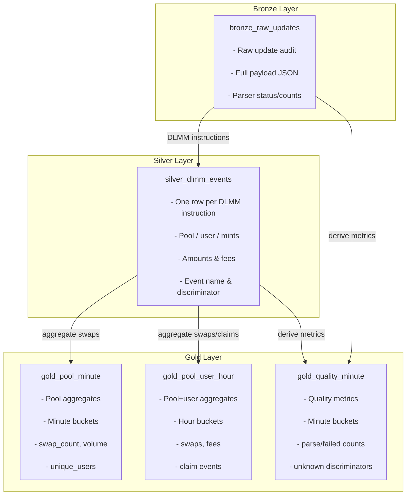

# Dune Project

Solana DLMM data platform prototype:

- Yellowstone gRPC ingestion
- IDL-based instruction/event parsing
- ClickHouse Medallion Architecture
- Query API (JSON + CSV)
- Vite dashboard for API exploration

## Architecture

```text
Yellowstone gRPC
  -> indexer (Rust)
  -> ClickHouse
      - bronze_raw_updates
      - silver_dlmm_events
      - gold_pool_minute
      - gold_pool_user_hour
      - gold_quality_minute
  -> api (Rust + Actix)
  -> dashboard (Vite)
```

## Architecture & Schema Diagrams

### System Architecture

```mermaid
graph TB
    subgraph "External Source"
        YS[Yellowstone gRPC Server]
    end

    subgraph "Indexer Service"
        YW[YellowstoneWorker]
        P[Parser Module]
        BW[BatchWriter + Transform]
    end

    subgraph "ClickHouse Database"
        BR[bronze_raw_updates]
        SR[silver_dlmm_events]
        GP[gold_pool_minute]
        GU[gold_pool_user_hour]
        GQ[gold_quality_minute]
    end

    subgraph "API Service"
        API[REST API<br/>JSON + CSV]
    end

    subgraph "Clients"
        DASH[Dashboard (Vite)]
        EXT[External Clients]
    end

    YS -->|gRPC stream| YW
    YW -->|SubscribeUpdate| P
    P -->|ParsedUpdate| BW
    BW -->|INSERT| BR
    BW -->|INSERT| SR
    BW -->|INSERT| GP
    BW -->|INSERT| GU
    BW -->|INSERT| GQ

    BR -->|SQL| API
    SR -->|SQL| API
    GP -->|SQL| API
    GU -->|SQL| API
    GQ -->|SQL| API

    API -->|HTTP/JSON| DASH
    API -->|HTTP/JSON| EXT
    API -->|HTTP/CSV| DASH
    API -->|HTTP/CSV| EXT
```

### Bronze / Silver / Gold Data Model



## Repository Layout

- `indexer/` : ingestion worker, parser, batch writer, ClickHouse ingest
- `api/` : HTTP API over ClickHouse tables
- `dashboard/` : frontend API runner and CSV download UI
- `schema/` : ClickHouse schema (`clickhouse_v2.sql`)
- `scripts/` : smoke/demo/load scripts
- `docs/` : architecture, data model, API contract, operations

## Prerequisites

- Docker + Docker Compose
- Rust toolchain
- Node.js (for dashboard only)
- Yellowstone endpoint and token

## Configuration

Configuration is loaded from dotenv files. The runtime is fail-fast for missing required env values.

Create:

- `indexer/.env`
- `api/.env`

### `indexer/.env` (required)

```bash
YELLOWSTONE_ENDPOINT=
YELLOWSTONE_TOKEN=
YELLOWSTONE_RECONNECT_MS=2000
YELLOWSTONE_SUBSCRIBE_MODE=transactions
PARSER_METRICS_EVERY=500

CLICKHOUSE_URL=http://127.0.0.1:8123
CLICKHOUSE_DATABASE=dune_project
CLICKHOUSE_USER=dune_project
CLICKHOUSE_PASSWORD=dune_project_pass
CLICKHOUSE_TIMEOUT_MS=8000
CLICKHOUSE_RECONNECT_SECS=5
CLICKHOUSE_DROP_LOG_SECS=30
CLICKHOUSE_MAX_BUFFER_RECORDS=50000

DB_BATCH_SIZE=500
DB_BATCH_FLUSH_MS=1000
DB_BATCH_QUEUE_SIZE=20000
DB_QUEUE_MODE=block
```

### `api/.env` (required)

```bash
API_HOST=127.0.0.1
API_PORT=8080

CLICKHOUSE_URL=http://127.0.0.1:8123
CLICKHOUSE_DATABASE=dune_project
CLICKHOUSE_USER=dune_project
CLICKHOUSE_PASSWORD=dune_project_pass
CLICKHOUSE_TIMEOUT_MS=8000
```

## Quick Start

From `dune_project/`:

```bash
make up
make schema
```

Run services in separate terminals:

```bash
make run-indexer
```

```bash
make run-api
```

Optional dashboard:

```bash
make dashboard-install
make dashboard-dev
```

Dashboard URL: `http://127.0.0.1:5174`

## Validation

Smoke test:

```bash
make smoke
```

Demo flow:

```bash
make demo
```

`scripts/demo.sh` variables:

- `API_BASE` (default `http://127.0.0.1:8080`)
- `MINUTES` (default `60`)
- `POOL` (optional)
- `CSV_LIMIT` (default `500`)
- `CSV_OUT` (default `exports/dlmm_events_<timestamp>.csv`)

## API Surface

System:

- `GET /health`
- `GET /healthz`
- `GET /metrics`

Observability:

- `GET /v1/ingestion/lag`
- `GET /v1/quality/latest`
- `GET /v1/quality/window?minutes=60`

Query:

- `GET /v1/swaps`
- `GET /v1/pools/top?minutes=60&limit=20`
- `GET /v1/pools/{pool}/summary?minutes=60`
- `GET /v1/pools/{pool}/events?limit=100`

Export:

- `GET /v1/export/events.csv`

## Example Requests

```bash
curl -sS http://127.0.0.1:8080/health
curl -sS "http://127.0.0.1:8080/v1/ingestion/lag"
curl -sS "http://127.0.0.1:8080/v1/pools/top?minutes=60&limit=10"
curl -sS "http://127.0.0.1:8080/v1/quality/window?minutes=60"
curl -sS -o exports/dlmm_events.csv "http://127.0.0.1:8080/v1/export/events.csv?limit=1000"
```

## Data Model

- `bronze_raw_updates`: raw parsed updates (audit/debug layer)
- `silver_dlmm_events`: canonical event facts (one row per DLMM instruction)
- `gold_pool_minute`: per-pool minute aggregates
- `gold_pool_user_hour`: per-pool/per-user hour aggregates
- `gold_quality_minute`: parser/ingestion quality aggregates

## Developer Commands

```bash
make fmt
make clippy
make check
make test
make dashboard-build
make up
make down
```

## Docs

- `docs/ARCHITECTURE.md`
- `docs/DATA_MODEL.md`
- `docs/API_CONTRACT.md`
- `docs/OPERATIONS.md`
